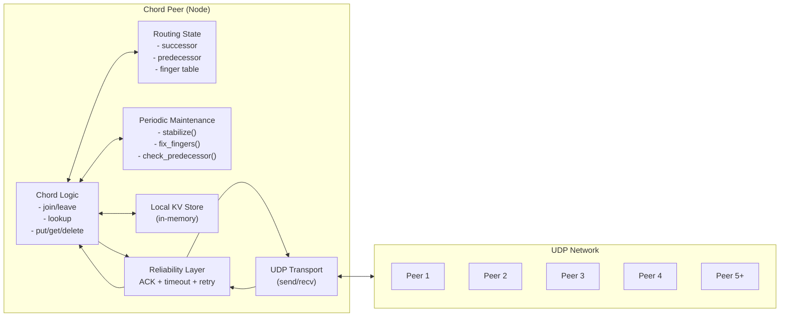

# Architecture

This implementation follows the classic Chord protocol with practical systems additions for UDP reliability and failure handling.

## High-level Design

## Components

### 1) `node.py` (core)
- Node identity + consistent hashing (SHA-1) in a circular ID space
- RPC-like operations: `join`, `leave`, `put`, `get`, `delete`
- Lookup acceleration using finger tables (logarithmic hops)
- Maintenance routines that periodically repair routing state
- Failure detection and ring repair (predecessor checks + stabilization)

### 2) `chord_cli.py` (interactive CLI)
- Starts a node with `(ip, port)` and optional introducer `(ip, port)` to join an existing ring
- Provides a simple `Chord>` shell to run `put/get/delete` and simulate leaves

### 3) UDP reliability enhancements
Because UDP is connectionless and does not guarantee delivery:
- receivers ACK messages
- senders wait for responses and retry on timeout
- failures trigger repair or user-visible error messages

## Message / Operation Types (conceptual)
- join, notify, stabilize
- put, get, delete
- leave, repair
