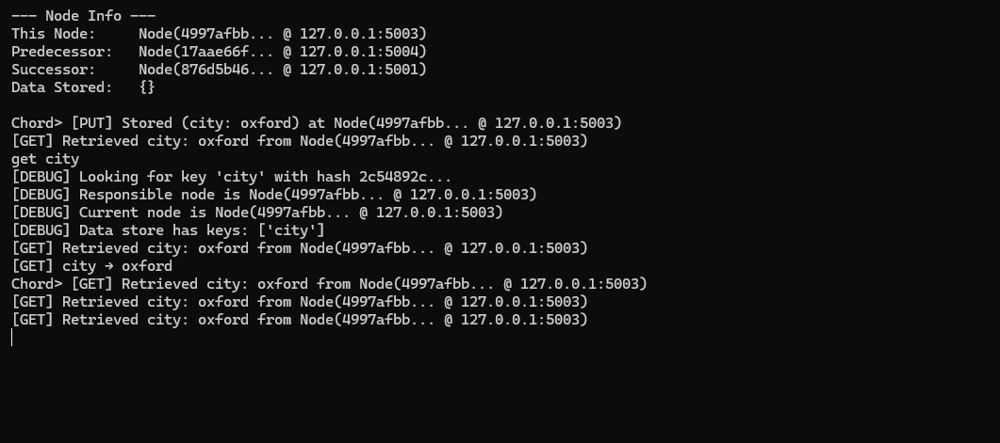
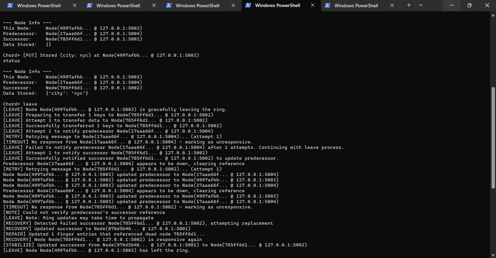
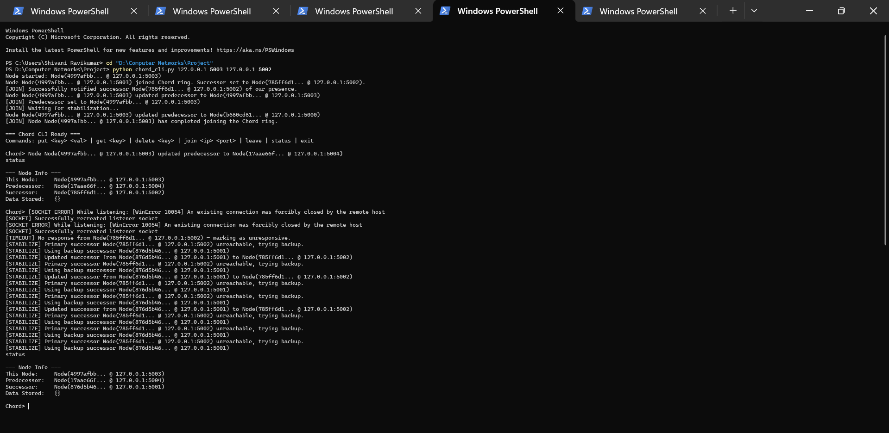

# Chord DHT (UDP) — Distributed Hash Table in Python

This project is a graduate-level implementation of the **Chord Distributed Hash Table (DHT)** protocol in **Python** using **UDP sockets**. It supports node churn (joins/leaves), efficient key lookups via finger tables (**O(log N)** hops), and a distributed key-value store with **PUT/GET/DELETE** operations. Communication uses UDP, with reliability enhancements (ACKs + timeouts + retries) to handle message loss.

## Key Features
- **Chord ring maintenance:** join, successor/predecessor pointers, periodic stabilization (`stabilize()`), finger-table refresh (`fix_fingers()`), and predecessor checks (`check_predecessor()`).
- **Routing:** finger tables to accelerate lookups from O(N) to **O(log N)**.
- **Key-value store:** `put`, `get`, `delete` routed to the responsible node by consistent hashing.
- **Fault tolerance:**
  - **Graceful leave:** transfers key-value pairs to successor and updates neighbors.
  - **Abrupt leave/crash:** detected via periodic checks; triggers repair during stabilization and finger-table repair.
- **CLI-driven distributed simulation:** each peer runs in its own terminal process.

## Repository Layout (expected)
- `node.py` — Core Chord implementation (Node class, networking, finger tables, join/leave, PUT/GET/DELETE, stabilization, fault recovery)
- `chord_cli.py` — Command-line launcher + interactive shell to operate a node and run commands

> Note: The report references these file names explicitly. If your filenames differ, rename them to match (or update this README accordingly).

## Requirements
- **Python 3.9+** (Python 3.8+ should also work in most cases)
- No external dependencies expected (UDP sockets + hashing + threading are standard library).

## How to Run (Local Multi-Node Demo)

Open **multiple terminals** (one per node). Each node runs as a separate process.

### 1) Start the first node (creates a new ring)
```bash
python chord_cli.py 127.0.0.1 5000
```

### 2) Start additional nodes (join an existing ring)
Start Node 2 by joining via Node 1:
```bash
python chord_cli.py 127.0.0.1 5001 127.0.0.1 5000
```

Start more nodes similarly:
```bash
python chord_cli.py 127.0.0.1 5002 127.0.0.1 5000
python chord_cli.py 127.0.0.1 5003 127.0.0.1 5000
python chord_cli.py 127.0.0.1 5004 127.0.0.1 5000
```

## CLI Commands (inside the `Chord>` prompt)

After a node starts, you can issue:

```text
put <key> <value>
get <key>
delete <key>
join <ip> <port>
leave
populate_fingers
Ctrl+C   (simulate abrupt leave)
```

### Example Session
```text
Chord> put movie Inception
Chord> get movie
Chord> delete movie
Chord> leave
```

## What You Should See
Each node prints logs for:
- joins/leaves and successor/predecessor updates
- lookup routing steps (e.g., “closest preceding node” behavior)
- stabilization + finger-table updates
- fault detection and repair behavior after crashes

These logs are intentionally verbose to support debugging and traceability in a distributed environment.

## Demo Screenshots

### PUT/GET across the ring


### Graceful leave with key transfer + ring update


### Abrupt failure detection + repair (backup successor / stabilization)



## Future Improvements (optional)
- Persistent storage (disk/DB) instead of in-memory
- Replication to successors for higher availability
- Authentication / message signing for security
- Visualization dashboard for ring topology and routing paths

---

If you use this repo on your resume, consider adding:
- screenshots of terminal output,
- a short demo GIF,
- and a small “Design” section (see `ARCHITECTURE.md`).
